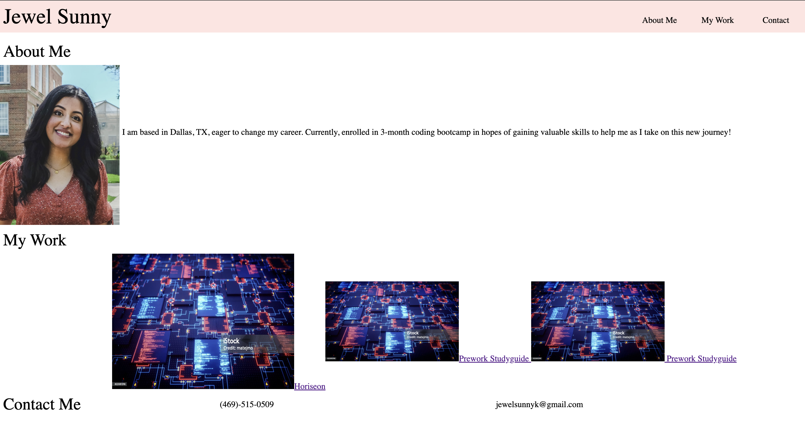

# Portfolio
Welcome to my portfolio, highlighting multiple applications I have created using the skills I learned in my coding journey. Explore the projects I have created!

## Description
The goal of creating this portfolio page is to highlight my coding skills as seen in the 'work' section. Creating this portfolio has allowed me to familiarize and solidify the content I haave learned during the first week of coding bootcamp. 

## Technologies Used
Front-End technologies such as HTML and CSS.

## Screenshots
Finished webpage should look like this:

## Credits
Reset CSS stylesheet:

 http://meyerweb.com/eric/tools/css/reset/ 
   v2.0 | 20110126
   License: none (public domain)

